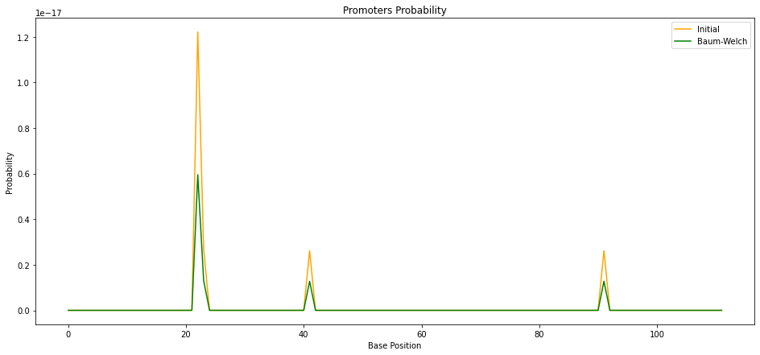

# CS466 Final Project

## Predicting Prokaryotic Promoter with Hidden Markov Models, Viterbi and Baum-Welch algorithms

---

## How to run

Download the Github repo to a folder named cs466_final_project and upload to your Google Drive.
Then, open final_project.ipynb in Google Colab and run all cells.

## Hand-tuned HMM with Viterbi

In a prokaryotic genome, upstream of a promoter for a gene, specifically at the -35 and -10 locations, there are two key consensus sequences that can be used as a flag to identify nearby protein-coding sequences. Theoretically, both of these sequences should appear together since they are both needed for translation of the gene.

We model CpG islands by creating a Hidden Markov Model (HMM) of the 1st order. The model assumes the presence of 3 hidden states: outside of both sequences, inside the -35 sequence, and inside the -10 sequence. After performing a traceback on the matrix generated from the dynamic programming Viterbi algorithm, the optimal path can be used to find the location of the sequences. The parts that pass through the -10 and -35 states will be the sequences of interest.

We use probabilities of nucleotides appearing inside these promoter regions from the well-studied E.Coli genome (see project report). We hand-calculated and tuned the emission and initial probabilities so that it best match our custom test sequence.

## Parameter Tuning Attempt with Baum-Welch Algorithm

We estimate transition and emission probabilities of the model only based on sequences containing promoter regions. We use a dataset of known Sigma70 core promoters for E.Coli to train. We use the Baum-Welch algorithm, which is a special case of the EM (expectation maximization) algorithm. It makes use of the forward-backward algorithm to compute the statistics for our expectation step.

However, we encounter a big problem with a "vanishing probability" problem where our probabilities gets significantly smaller every training step. We've attempted to convert our calculations to log-space but to no avail. Unfortunately, we ran out of time before being able to get Baum-Welch to work, but the faulty probabilites estimates that we get still somewhat lined up with our test sequence.

## Future improvements

We believe with extra time, we would be able to implement more hidden states and get a much better accuracy. We would also prefer to implement an empirical testing system to compare our accuracy against other promoter finders on a larger dataset of sequences.
